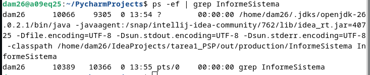

# Tarea 1

**Módulo:** Programación de servizos e procesos  
**Alumno:** Andres Peraza

---

## 2. El proceso, desde fuera

### Búsqueda del proceso (`ps -ef | grep InformeSistema`)

Al ejecutar el programa en la terminal mientras se encuentra en la espera final (`Pulsa INTRO para terminar...`), se obtiene la siguiente salida:

PID: 10366

PPID: 10389